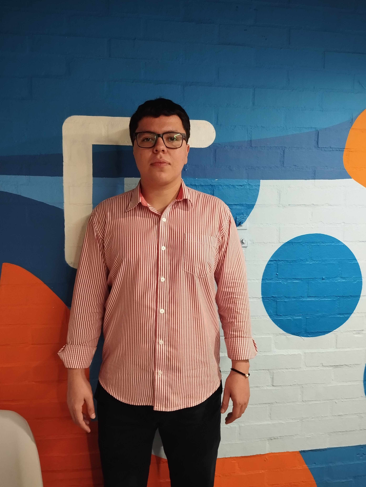

# Git and Github Practice

## Introduction

Hi, My name is THOMAS CAMILO VANEGAS ACEVEDO

I'm participating in **Neocamp** bootcamp.

Some of my goals for this bootcamp are improving my programming skills and upgrading my teamwork skills.

---

## About me

**City:** Medellín, Colombia.

**Favorite Technology:** Java and Python

**Hobby:** Reading books, coding, and spend time with my family.

---

## Contact
1. Professional Github: https://github.com/thomasvanegasmeli/ 
2. Personal Github: https://github.com/thomasvanegas/ 
3. LinkedIn (send me the invitation to conect) ): https://co.linkedin.com/in/thomasvanegasdev
